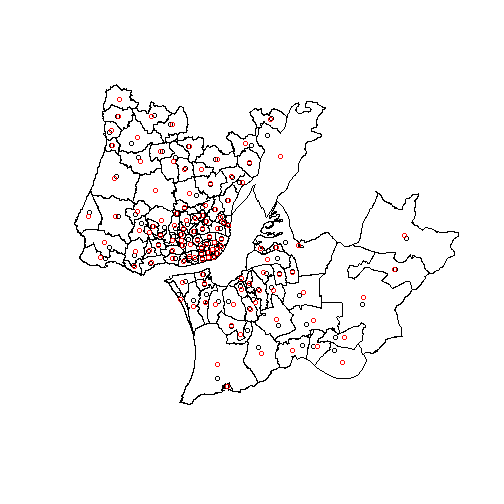

```r
# Aim: test R installations have the necessary packages installed

install.packages("remotes", quiet = TRUE)
remotes::install_cran(c("sf", "stplanr", "pct", "tmap", "dplyr"), quiet = TRUE)

# test the sf package
u1 = "https://github.com/U-Shift/cyclingpotential-hack/releases/download/1.0/city_centroids.geojson"
centroids = sf::read_sf(u1)
plot(centroids)
```


```r
# check interactive mapping with tmap
library(tmap)
tmap_mode("view")
```

```
## tmap mode set to interactive viewing
```

```r
u2 = "https://github.com/U-Shift/cyclingpotential-hack/releases/download/1.0/desire_lines_integers.geojson"
desire_lines = sf::read_sf(u2)
tm_shape(desire_lines) +
  tm_lines(col = "Bike", palette = "viridis", lwd = "Car", scale = 9)
```

```
## Linking to GEOS 3.8.0, GDAL 3.0.4, PROJ 7.0.0
```

```
## Legend for line widths not available in view mode.
```



```r
# check route network generation with stplanr
library(stplanr)
u3 = "https://github.com/U-Shift/cyclingpotential-hack/releases/download/1.0/routes_integers_cs_balanced.geojson"
routes = sf::read_sf(u3)
rnet = overline(routes, "Bike") 
tm_shape(rnet) +
  tm_lines(lwd = "Bike", scale = 5, col = "Bike", palette = "viridis")
```

```
## Legend for line widths not available in view mode.
```


```r
# check analysis with dplyr and estimation of cycling uptake with pct function
library(pct)
library(dplyr)
```

```
## 
## Attaching package: 'dplyr'
```

```
## The following objects are masked from 'package:stats':
## 
##     filter, lag
```

```
## The following objects are masked from 'package:base':
## 
##     intersect, setdiff, setequal, union
```

```r
u3 = "https://github.com/U-Shift/cyclingpotential-hack/releases/download/1.0/routes_integers_cs_balanced.geojson"
route_segments_balanced = sf::read_sf(u3)
routes_balanced = route_segments_balanced %>% 
  group_by(Origem, Destino) %>% 
  summarise(
    Origem = first(Origem),
    Destino = first(Destino),
    Bike = mean(Bike),
    All = mean(Bike) + mean(Car) + mean(Motorcycle) + mean(Transit) + mean(Walk) + mean(Other),
    Length_balanced_m = sum(distances),
    Hilliness_average = mean(gradient_segment),
    Hilliness_90th_percentile = quantile(gradient_segment, probs = 0.9)
  ) %>% 
  sf::st_cast("LINESTRING")
```

```
## `summarise()` regrouping output by 'Origem' (override with `.groups` argument)
```

```
## Warning in st_cast.sf(., "LINESTRING"): repeating attributes for all sub-geometries for which they may not be constant
```

```r
summary(routes_balanced$Length_balanced_m)
```

```
##    Min. 1st Qu.  Median    Mean 3rd Qu.    Max. 
##    4569   14859   24508   22125   27717   43542
```

```r
routes_balanced$Potential = pct::uptake_pct_godutch(
  distance = routes_balanced$Length_balanced_m,
  gradient = routes_balanced$Hilliness_average
    ) * 
  routes_balanced$All
```

```
## Distance assumed in m, switching to km
```

```r
rnet_balanced = overline(routes_balanced, "Potential")
b = c(0, 0.5, 1, 2, 3, 8) * 1e4
tm_shape(rnet_balanced) +
  tm_lines(lwd = "Potential", scale = 9, col = "Potential", palette = "viridis", breaks = b)
```

```
## Legend for line widths not available in view mode.
```


```r
# generate output report
# knitr::spin(hair = "code/reproducible-example.R")
```

