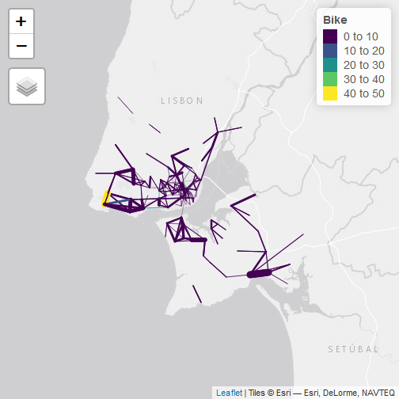
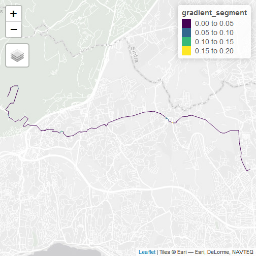
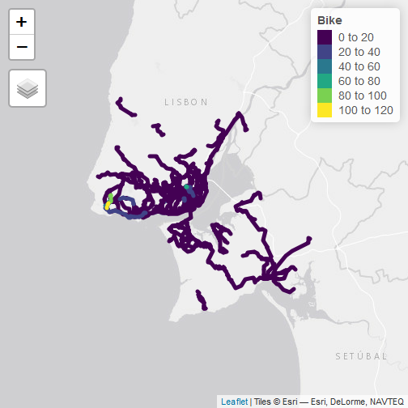

```r
# Aim: test R installations have the necessary packages installed

install.packages("remotes", quiet = TRUE)
```

```
## Error in install.packages : Updating loaded packages
```

```r
remotes::install_cran(c("sf", "stplanr", "pct", "tmap", "dplyr"), quiet = TRUE)
```

```
## Installing 1 packages: tmap
```

```r
# piggyback::pb_upload("od_data_final.csv")
# piggyback::pb_upload("desire_lines_final.geojson")
# piggyback::pb_upload("districts.geojson")
# # piggyback::pb_download(file = "CENTROIDS.Rds", repo = "U-Shift/pct-lisbon2")
# # centroids = readRDS("CENTROIDS.Rds")
# st_write(centroids, "centroids.geojson")
u_od = "od_data_final.csv"
od_data = read.csv("od_data_final.csv")
```

```
## Warning in file(file, "rt"): cannot open file 'od_data_final.csv': No such
## file or directory
```

```
## Error in file(file, "rt"): cannot open the connection
```

```r
head(od_data)
```

```
##   DICOFREor11 DICOFREde11  Car CarP Bike Walk Other Total Length_euclidean
## 1      110501      110506  336   44    0    0     6   385         7340.246
## 2      110501      110507  227  109    0    7    18   361         8684.329
## 3      110501      110508 1095  332   41  341   316  2125         3521.560
## 4      110501      111128  172   50    0    1    42   265         6300.765
## 5      110506      110501  319   14    0    0    36   368         7340.246
## 6      110506      110507  594  178    0  126   121  1019         3434.600
##   pcycle_current pactiv_current
## 1           0.00           0.00
## 2           0.00           0.02
## 3           0.02           0.18
## 4           0.00           0.00
## 5           0.00           0.00
## 6           0.00           0.12
```

```r
plot(od_data$Length_euclidean, od_data$pcycle_current)
```


```r
library(sf)
# test the sf package
# u1 = "https://github.com/U-Shift/cyclingpotential-hack/releases/download/1.0/city_centroids.geojson"
u1 = "districts.geojson"
u1b = "centroids.geojson"
districts = read_sf(u1)
```

```
## Error: Cannot open "districts.geojson"; The file doesn't seem to exist.
```

```r
plot(centroids)
```


```r
centroids_geo = st_centroid(districts)
```

```
## Warning in st_centroid.sf(districts): st_centroid assumes attributes are
## constant over geometries of x
```

```
## Warning in st_centroid.sfc(st_geometry(x), of_largest_polygon =
## of_largest_polygon): st_centroid does not give correct centroids for
## longitude/latitude data
```

```r
plot(districts$geometry)
plot(centroids$geometry, add = TRUE)
plot(centroids_geo$geometry, add = TRUE, col = "red")
```



```r
# check interactive mapping with tmap
library(tmap)
tmap_mode("view")
```

```
## tmap mode set to interactive viewing
```

```r
# u2 = "https://github.com/U-Shift/cyclingpotential-hack/releases/download/1.0/desire_lines_integers.geojson"
u2 = "desire_lines_final.geojson"
desire_lines = sf::read_sf(u2)
```

```
## Error: Cannot open "desire_lines_final.geojson"; The file doesn't seem to exist.
```

```r
tm_shape(desire_lines) +
  tm_lines(col = "Bike", palette = "viridis", lwd = "Car", scale = 9)
```

```
## Legend for line widths not available in view mode.
```



```r
# check route network generation with stplanr
library(stplanr)
# u3 = "https://github.com/U-Shift/cyclingpotential-hack/releases/download/1.0/routes_integers_cs_balanced.geojson"
u3 = "routes_fast.geojson"
routes = sf::read_sf(u3)
```

```
## Error: Cannot open "routes_fast.geojson"; The file doesn't seem to exist.
```

```r
tm_shape(routes[]) +
  tm_lines()
```



```r
rnet = overline(routes, "Bike") 
```

```
## 2020-09-15 16:50:00 constructing segments
```

```
## 2020-09-15 16:50:01 building geometry
```

```
## 2020-09-15 16:50:02 simplifying geometry
```

```
## 2020-09-15 16:50:02 aggregating flows
```

```
## 2020-09-15 16:50:03 rejoining segments into linestrings
```

```r
tm_shape(rnet) +
  tm_lines(scale = 5, col = "Bike", palette = "viridis")
```


```r
# check analysis with dplyr and estimation of cycling uptake with pct function
library(pct)
library(dplyr)
route_segments_balanced = sf::read_sf(u3)
```

```
## Error: Cannot open "routes_fast.geojson"; The file doesn't seem to exist.
```

```r
routes_balanced = route_segments_balanced %>% 
  group_by(DICOFREor11, DICOFREde11) %>% 
  summarise(
    Bike = mean(Bike),
    All = sum(Total),
    Length_balanced_m = sum(distances),
    Hilliness_average = mean(gradient_segment),
    Hilliness_90th_percentile = quantile(gradient_segment, probs = 0.9)
  ) %>% 
  sf::st_cast("LINESTRING")
```

```
## `summarise()` regrouping output by 'DICOFREor11' (override with `.groups` argument)
```

```
## Warning in st_cast.sf(., "LINESTRING"): repeating attributes for all sub-
## geometries for which they may not be constant
```

```r
summary(routes_balanced$Length_balanced_m)
```

```
##    Min. 1st Qu.  Median    Mean 3rd Qu.    Max. 
##    1738    4316    6529    7739    9710   24925
```

```r
routes_balanced$Potential = pct::uptake_pct_godutch(
  distance = routes_balanced$Length_balanced_m,
  gradient = routes_balanced$Hilliness_average
    ) * 
  routes_balanced$All
```

```
## Distance assumed in m, switching to km
```

```r
rnet_balanced = overline(routes_balanced, "Potential")
```

```
## 2020-09-15 16:50:06 constructing segments
```

```
## 2020-09-15 16:50:06 building geometry
```

```
## 2020-09-15 16:50:08 simplifying geometry
```

```
## 2020-09-15 16:50:08 aggregating flows
```

```
## 2020-09-15 16:50:10 rejoining segments into linestrings
```

```r
b = c(0, 0.5, 1, 2, 3, 8) * 1e4
tm_shape(rnet_balanced) +
  tm_lines(lwd = "Potential", scale = 9, col = "Potential", palette = "viridis", breaks = b)
```

```
## Warning: Values have found that are higher than the highest break
```

```
## Legend for line widths not available in view mode.
```


```r
# generate output report
# knitr::spin(hair = "code/reproducible-example.R")

# # to convert OD data into desire lines with the od package you can uncomment the following lines
# # system.time({
# test_desire_lines1 = stplanr::od2line(od_data, centroids)
# # })
# # system.time({
# test_desire_lines2 = od::od_to_sf(x = od_data, z = centroids)
# # })
# plot(test_desire_lines2)

# test routing on a single line (optional - uncomment to test this)
# warning you can only get a small number, e.g. 5, routes before this stops working!
# library(osrm)
# single_route = route(l = desire_lines[1, ], route_fun = osrm::osrmRoute, returnclass = "sf")
# mapview::mapview(desire_lines[1, ]) +
#   mapview::mapview(single_route)
# see https://cran.r-project.org/package=cyclestreets and other routing services
# for other route options, e.g. https://github.com/ropensci/opentripplanner
```

